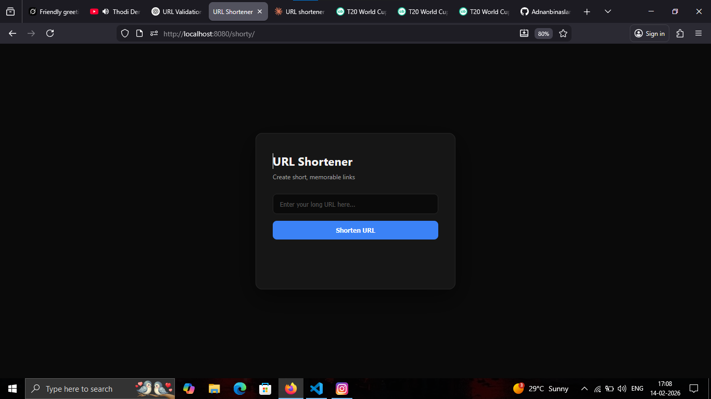
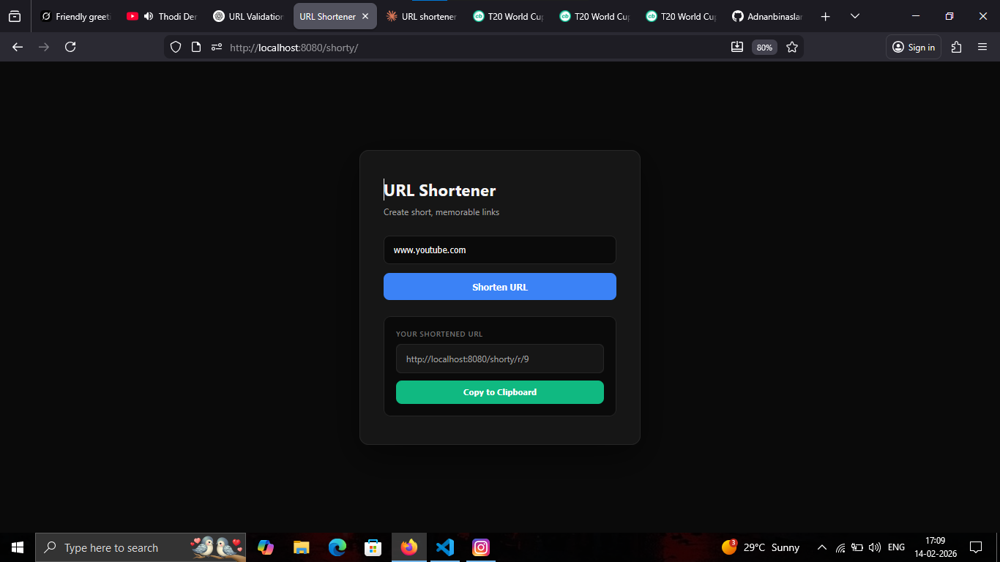
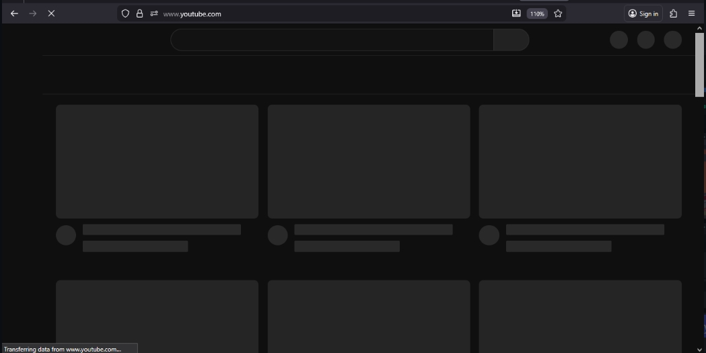

# 🔗 URL Shortener

A modern, fast URL shortening service built with Spring Boot and a clean dark-themed frontend.

## 🎨 UI Preview






The application features a minimalist dark theme with:
- Elegant color scheme
- Smooth transitions
- Instant feedback on actions
- Mobile-responsive layout

## ✨ Features

- **Lightning Fast** - Instant URL shortening with minimal latency
- **Clean UI** - Modern dark-themed interface with smooth interactions
- **REST API** - Simple and intuitive API endpoints
- **Persistent Storage** - URLs stored reliably in database
- **One-Click Copy** - Easy clipboard integration
- **Responsive Design** - Works seamlessly on all devices

## 🚀 Quick Start

### Prerequisites

- Java 17 or higher
- Maven 3.6+
- Your favorite IDE (IntelliJ IDEA, Eclipse, VS Code)

### Installation

1. **Clone the repository**
   ```bash
   git clone https://github.com/Adnanbinaslam/url-shortener.git
   cd url-shortener
   ```

2. **Build the project**
   ```bash
   ./mvnw clean install
   ```

3. **Run the application**
   ```bash
   ./mvnw spring-boot:run
   ```

4. **Access the application**
   - Frontend: `http://localhost:8080`
   - API Base: `http://localhost:8080/shorty`

## 📖 API Documentation

### Shorten a URL

**Endpoint:** `POST /shorty/create`

**Request Body:**
```json
{
  "originalUrl": "https://example.com/very/long/url"
}
```

**Response:**
```json
{
  "shortUrl": "abc123",
  "originalUrl": "https://example.com/very/long/url"
}
```

### Redirect to Original URL

**Endpoint:** `GET /shorty/r/{shortCode}`

**Example:**
```
http://localhost:8080/shorty/r/abc123
```

Redirects to the original URL.

## 🏗️ Project Structure

```
url-shortener/
├── src/
│   ├── main/
│   │   ├── java/
│   │   │   └── com/adnan/urlshortener/
│   │   │       ├── controller/      # REST controllers
│   │   │       ├── service/         # Business logic
│   │   │       ├── repository/      # Data access layer
│   │   │       ├── model/           # Entity classes
│   │   │       └── exception/       # Custom exceptions
│   │   └── resources/
│   │       ├── static/
│   │       │   └── index.html       # Frontend UI
│   │       └── application.properties
│   └── test/                        # Unit & integration tests
├── pom.xml
└── README.md
```

## 🛠️ Technologies Used

### Backend
- **Spring Boot** - Application framework
- **Spring Data JPA** - Database operations
- **H2/MySQL** - Database (configurable)
- **Maven** - Dependency management

### Frontend
- **Vanilla JavaScript** - No framework overhead
- **Modern CSS** - Clean, responsive design
- **Fetch API** - Async HTTP requests

## ⚙️ Configuration

Edit `src/main/resources/application.properties`:

```properties
# Server Configuration
server.port=8080

# Database Configuration (H2 example)
spring.datasource.url=jdbc:h2:mem:urlshortener
spring.datasource.driverClassName=org.h2.Driver
spring.jpa.hibernate.ddl-auto=update

# For MySQL (uncomment and configure)
# spring.datasource.url=jdbc:mysql://localhost:3306/urlshortener
# spring.datasource.username=root
# spring.datasource.password=yourpassword
```

## 🎨 UI Preview

The application features a minimalist dark theme with:
- Elegant color scheme
- Smooth transitions
- Instant feedback on actions
- Mobile-responsive layout

## 🧪 Testing

Run tests with:
```bash
./mvnw test
```

## 📦 Building for Production

Create a production-ready JAR:
```bash
./mvnw clean package
```

Run the JAR:
```bash
java -jar target/urlshortener-0.0.1-SNAPSHOT.jar
```

## 🚢 Deployment

### Docker (Optional)

Create a `Dockerfile`:
```dockerfile
FROM openjdk:17-jdk-slim
COPY target/*.jar app.jar
ENTRYPOINT ["java","-jar","/app.jar"]
```

Build and run:
```bash
docker build -t url-shortener .
docker run -p 8080:8080 url-shortener
```

### Cloud Platforms
- **Heroku**: `git push heroku main`
- **AWS Elastic Beanstalk**: Upload JAR file
- **Google Cloud Run**: Deploy containerized app

## 🤝 Contributing

Contributions are welcome! Please feel free to submit a Pull Request.

1. Fork the project
2. Create your feature branch (`git checkout -b feature/AmazingFeature`)
3. Commit your changes (`git commit -m 'Add some AmazingFeature'`)
4. Push to the branch (`git push origin feature/AmazingFeature`)
5. Open a Pull Request

## 📝 Future Enhancements

- [ ] Custom short codes
- [ ] Analytics dashboard (click tracking)
- [ ] QR code generation
- [ ] Link expiration
- [ ] User authentication
- [ ] Rate limiting
- [ ] API key management

## 📄 License

This project is licensed under the MIT License - see the [LICENSE](LICENSE) file for details.

## 👤 Author

**Adnan Bin Aslam**

- GitHub: [@Adnanbinaslam](https://github.com/Adnanbinaslam)
- Project Link: [https://github.com/Adnanbinaslam/url-shortener](https://github.com/Adnanbinaslam/url-shortener)

## 🙏 Acknowledgments

- Spring Boot team for the excellent framework
- The open-source community

---

⭐ If you found this project useful, please consider giving it a star!